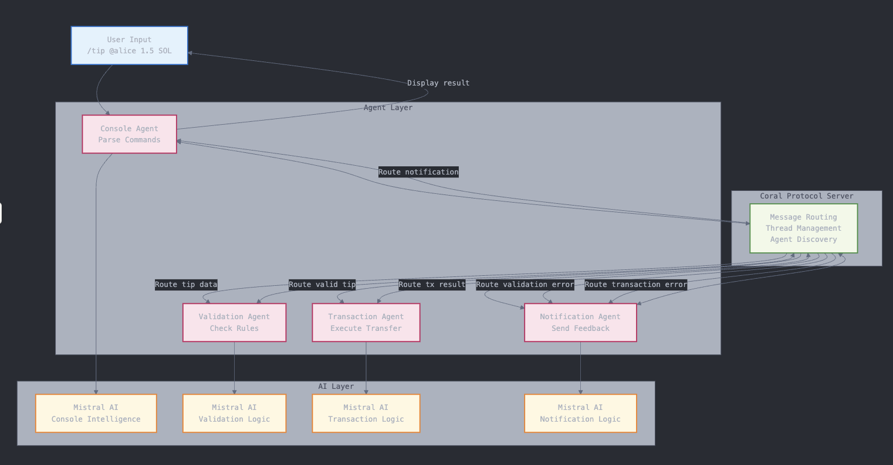

# 🚀 Coral Protocol + Mistral AI Crypto Tipping System

A console-based crypto tipping system using Coral Protocol multi-agent architecture with Mistral AI for intelligent tip processing.

## ⚡ Quick Start

```bash
# 1. Setup environment
cp .env.example .env
# Edit .env with your Mistral API key

# 2. Install dependencies
curl -LsSf https://astral.sh/uv/install.sh | sh

# 3. Start system
./run.sh

# 4. Use the system
/tip @alice 1.5 SOL Great work!
/balance
/history
```

## 🏗️ Architecture

**Multi-Agent System** with 4 specialized agents:
- **Console Agent** - User interface and command parsing
- **Validation Agent** - Fraud detection and business rule validation  
- **Transaction Agent** - Simulated SOL transfer execution
- **Notification Agent** - Result notifications and feedback



## 📋 Prerequisites

- Python 3.9+
- Node.js 18+ (for Coral Server)
- Java 17+ (for Coral Server)
- Mistral API Key (free tier: 1M tokens/month)

## 🔧 Configuration

### Environment Variables (`.env`)
```bash
# Mistral AI (Required)
MISTRAL_API_KEY=your_mistral_api_key_here
MODEL_NAME=mistral-small
MODEL_PROVIDER=mistral

# System Configuration
CORAL_CONNECTION_URL=http://localhost:8080
INITIAL_BALANCE=100.0
MIN_TIP_AMOUNT=0.001
MAX_TIP_AMOUNT=100.0
SIMULATION_MODE=true
```

### Agent Registry (`registry.toml`)
```toml
[[local-agent]]
path = "agents/console"

[[local-agent]]
path = "agents/validation"

[[local-agent]]
path = "agents/transaction"

[[local-agent]]
path = "agents/notification"
```

## 💬 Usage Commands

```bash
/tip @recipient amount SOL message  # Send a tip
/balance                           # Check balance
/history                          # View transactions
/help                            # Show commands
/quit                           # Exit system
```

## 📁 Project Structure

```
tippin-sol/
├── agents/
│   ├── console/         # User interface agent
│   ├── validation/      # Tip validation agent  
│   ├── transaction/     # Transaction execution agent
│   └── notification/    # Notification agent
├── coral-server/        # Coral Protocol server
├── .env                 # Environment configuration
├── registry.toml        # Agent registry
├── run.sh              # System startup
├── stop.sh             # System shutdown
└── test_system.py      # Integration tests
```

## ✨ Features

### 🛡️ Advanced Validation
- **Amount limits** with configurable min/max values
- **Spam detection** using keyword and pattern recognition
- **Rate limiting** to prevent abuse (max 10 tips per 5 minutes)
- **Risk scoring** with fraud detection algorithms

### 💸 Transaction Processing
- **Simulated SOL transfers** for safe testing
- **Balance management** with real-time updates
- **Unique transaction IDs** for tracking
- **Mock Solana explorer** integration

### 🎮 User Experience
- **Interactive console** with intuitive commands
- **Real-time feedback** for all operations
- **Transaction history** with recent activity
- **Clear error handling** and recovery guidance

## 🚀 Deployment

### Start System
```bash
./run.sh
```

### Stop System  
```bash
./stop.sh
```

### Run Tests
```bash
python test_system.py
```

## 🔄 Agent Workflow

1. **Console Agent** parses user tip command
2. **Validation Agent** validates tip against business rules
3. **Transaction Agent** executes simulated SOL transfer
4. **Notification Agent** sends success/failure notifications
5. **Console Agent** displays final result to user

## 🛠️ Development

### Agent Structure
Each agent contains:
- `main.py` - Core agent logic
- `coral-agent.toml` - Agent configuration
- `pyproject.toml` - Python dependencies
- `run_agent.sh` - Startup script

### Adding New Agents
1. Create agent directory in `agents/`
2. Implement agent files following existing pattern
3. Add agent path to `registry.toml`
4. Update startup scripts

## 🔮 Future Enhancements

### Production Ready
- **Real Solana integration** replacing mock transactions
- **Database persistence** for transactions and users
- **Web interface** with React frontend
- **REST API** for external integrations

### Advanced Features
- **Recurring tips** with scheduled payments
- **Tip pools** for group contributions
- **Analytics dashboard** with insights
- **Multi-token support** beyond SOL

### Enterprise
- **Admin panel** for system management
- **Compliance tools** (AML/KYC)
- **Multi-tenant** architecture
- **High availability** with load balancing

## 🐛 Troubleshooting

### Common Issues
- **Coral Server not starting**: Check Java 17+ installation
- **Agent connection fails**: Verify `.env` configuration
- **Mistral API errors**: Check API key and rate limits

### Logs
- System logs: `server.log`
- Agent logs: Console output during execution

## 📖 Documentation

- [Coral Protocol Docs](https://coral-protocol.com/docs)
- [Mistral AI API](https://docs.mistral.ai/)
- [Solana Documentation](https://docs.solana.com/)

## 🤝 Contributing

1. Fork the repository
2. Create feature branch
3. Follow existing code patterns
4. Add tests for new features
5. Submit pull request

## 📄 License

MIT License - see LICENSE file for details

---

**Ready to revolutionize crypto tipping! 🚀**

---

# DETAILED IMPLEMENTATION GUIDE (ORIGINAL)

## Senior Engineer Implementation Specifications

A console-based crypto tipping system built with Coral Protocol's multi-agent architecture and powered by Mistral AI. This system enables secure, validated SOL tipping through an intelligent agent network.

## 🏗️ System Architecture

### Multi-Agent Design
- **Console Agent** - User interface and command coordination
- **Validation Agent** - Fraud detection and business rule validation  
- **Transaction Agent** - Simulated SOL transfer execution
- **Notification Agent** - Result notifications and user feedback

### Technology Stack
- **Coral Protocol** - Multi-agent orchestration platform
- **Mistral AI** - Free AI model for agent intelligence (1M tokens/month)
- **Python 3.9+** - Agent implementation language
- **Node.js 18+** & **Java 17+** - Coral Server requirements

## 📋 Prerequisites

### Required Software
```bash
# Core requirements
- Python 3.9+
- Node.js 18+
- Java 17+
- Git

# Package managers
- uv (Python): curl -LsSf https://astral.sh/uv/install.sh | sh
- npm (Node.js): included with Node.js
```

### API Keys
- **Mistral API Key** (Free tier available)
- Sign up at [Mistral AI](https://mistral.ai/) for free access

## 🚀 Quick Start

### 1. Environment Setup
```bash
# Clone or create project directory
mkdir tippin-sol && cd tippin-sol

# Create environment file
cat > .env << 'EOF'
MISTRAL_API_KEY=your_mistral_api_key_here
MODEL_NAME=mistral-small
MODEL_PROVIDER=mistral
MODEL_TEMPERATURE=0.3
MODEL_MAX_TOKENS=4000
CORAL_CONNECTION_URL=http://localhost:8080
TIMEOUT_MS=60000
INITIAL_BALANCE=100.0
MIN_TIP_AMOUNT=0.001
MAX_TIP_AMOUNT=100.0
SIMULATION_MODE=true
EOF
```

### 2. Install Dependencies
```bash
# Install uv package manager
curl -LsSf https://astral.sh/uv/install.sh | sh

# Setup project structure
mkdir -p agents/{console,validation,transaction,notification}
mkdir -p coral-server
```

### 3. Configure Agent Registry
```bash
cat > registry.toml << 'EOF'
[[local-agent]]
path = "agents/console"

[[local-agent]]
path = "agents/validation"

[[local-agent]]
path = "agents/transaction"

[[local-agent]]
path = "agents/notification"
EOF
```

### 4. Start the System
```bash
# Make scripts executable
chmod +x run.sh stop.sh test_system.py

# Run integration tests
python test_system.py

# Start the complete system
./run.sh
```

## 💬 Usage Commands

Once the system is running, use these console commands:

```bash
# Send a tip
/tip @recipient 1.5 SOL Great work on the project!

# Check your balance
/balance

# View transaction history
/history

# Get help
/help

# Exit system
/quit
```

## 📁 Project Structure

```
tippin-sol/
├── agents/
│   ├── console/              # User interface agent
│   ├── validation/           # Tip validation agent
│   ├── transaction/          # Transaction execution agent
│   └── notification/         # Notification agent
├── coral-server/             # Coral Protocol server
├── .env                      # Environment configuration
├── registry.toml             # Agent registry
├── run.sh                    # System startup script
├── stop.sh                   # System shutdown script
└── test_system.py            # Integration tests
```

## ✨ Key Features

### 🛡️ Advanced Validation
- **Amount Limits**: Configurable min/max tip amounts
- **Spam Detection**: Keyword and pattern recognition
- **Rate Limiting**: Prevents abuse (max 10 tips per 5 minutes)
- **Fraud Detection**: Risk scoring algorithms

### 💸 Transaction Processing
- **Simulated Execution**: Mock SOL transfers for testing
- **Balance Management**: Real-time balance tracking
- **Transaction IDs**: Unique identifiers for each tip
- **Explorer Integration**: Mock Solana explorer links

### 🎮 User Experience
- **Interactive Console**: Intuitive command interface
- **Real-time Feedback**: Immediate response to commands
- **Transaction History**: View past tips and balances
- **Error Handling**: Clear error messages and recovery

## 🔧 Configuration

### Environment Variables
| Variable | Description | Default |
|----------|-------------|---------|
| `MISTRAL_API_KEY` | Mistral AI API key | Required |
| `MODEL_NAME` | AI model to use | `mistral-small` |
| `INITIAL_BALANCE` | Starting SOL balance | `100.0` |
| `MIN_TIP_AMOUNT` | Minimum tip amount | `0.001` |
| `MAX_TIP_AMOUNT` | Maximum tip amount | `100.0` |

### Validation Rules
- Tip amounts must be between 0.001 and 100 SOL
- Recipients must have valid format (minimum 2 characters)
- Spam keyword detection in messages
- Rate limiting: maximum 10 tips per 5 minutes

## 🧪 Testing

```bash

# Test individual components
./agents/console/run_agent.sh main.py
./agents/validation/run_agent.sh main.py
```

## 🛑 Stopping the System

```bash
# Graceful shutdown of all components
./stop.sh
```

## 🚀 Next Steps

### Production Enhancements
- **Real Solana Integration**: Replace mock transactions with actual SOL transfers
- **Database Integration**: Persistent storage for transactions
- **Web Interface**: React frontend for better UX
- **Authentication**: User accounts and wallet connections

### Advanced Features
- **Recurring Tips**: Scheduled automatic payments
- **Tip Pools**: Shared tipping pools for groups
- **Analytics Dashboard**: Transaction insights and metrics
- **Multi-token Support**: Support for other cryptocurrencies

## 📄 License

This project is licensed under the MIT License.