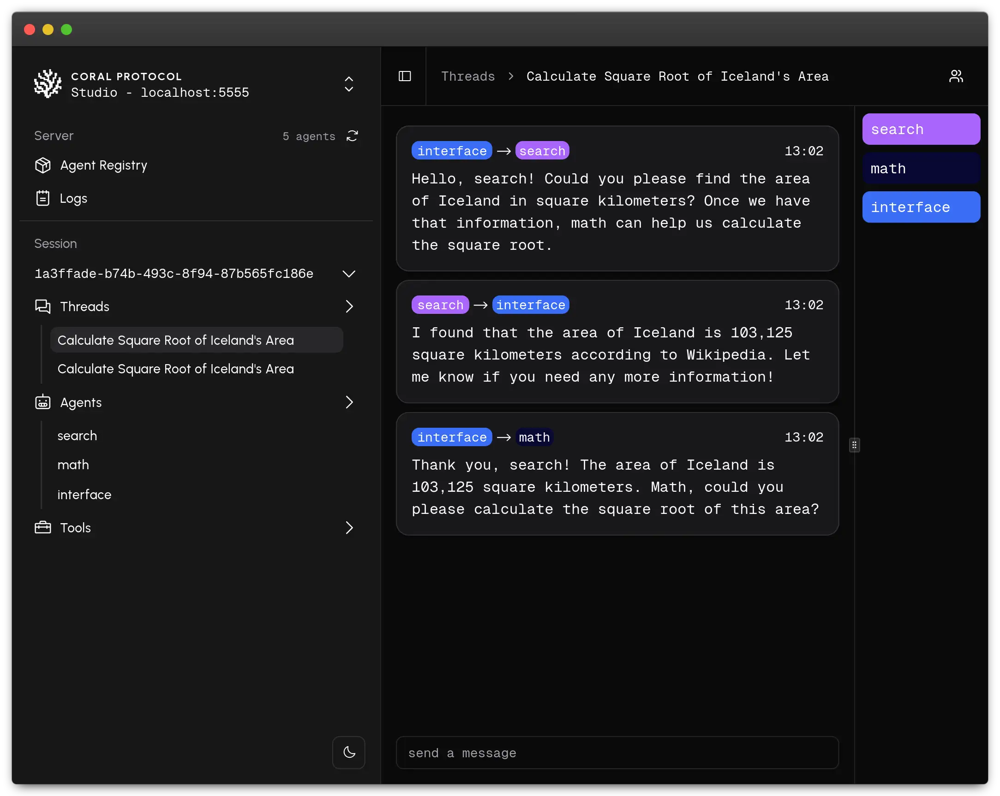
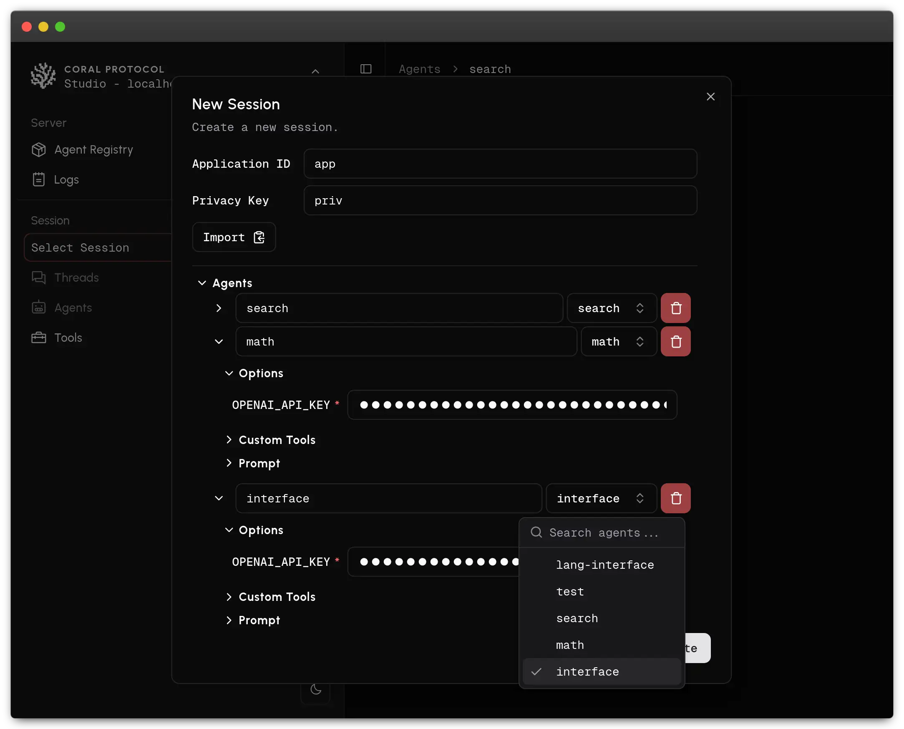
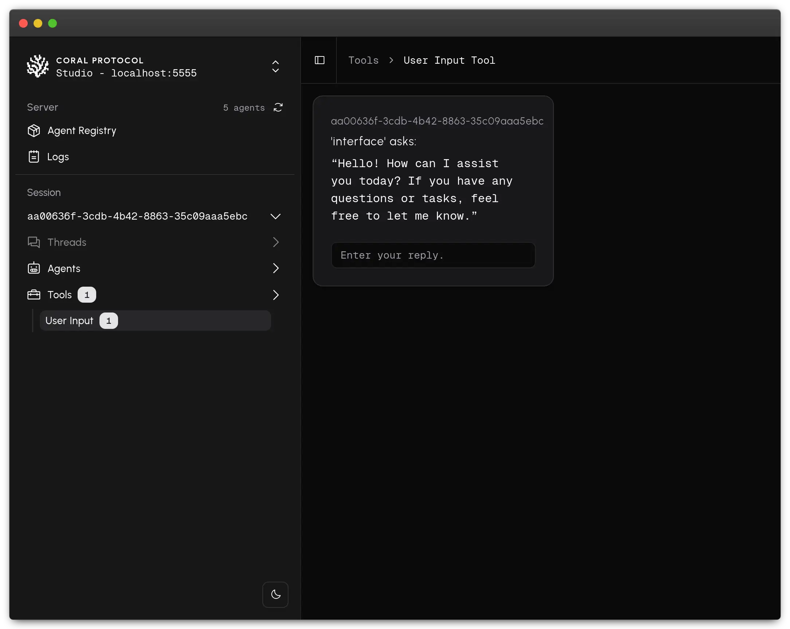

# coral-studio
Create, manage & inspect agent sessions through [Coral Server](https://github.com/Coral-Protocol/coral-server/).



# Getting Started
<!-- ### Running via npx -->
<!---->
<!-- ```bash -->
<!-- npx @coral-protocol/coral-studio -->
<!-- ``` -->
<!-- Coral studio will be available at [`http://localhost:3000/`](http://localhost:3000/) -->

### Running via Docker
```bash
docker run -p 3000:3000 ghcr.io/coral-protocol/coral-studio
```
Coral studio will be available at [`http://localhost:3000/`](http://localhost:3000/)

### Run from source
Install dependencies with:
```bash
yarn install
```

Then build and serve with:


```bash
yarn build
yarn preview
```

Coral studio will be available at [`http://localhost:4173/`](http://localhost:4173/)

# Screenshots




# Developing
Start a development server with
```bash
yarn dev
```
Coral studio will be available at [`http://localhost:5173/`](http://localhost:5173/)


